# Vite Flare Starter

**Production-ready AI agent starter kit for Cloudflare Workers.** Ship a conversational AI product with tool calling, skills, file uploads, and admin ops — built the way we build at Jezweb.

[](https://deploy.workers.cloudflare.com/?url=https://github.com/jezweb/vite-flare-starter)

**[Live Demo](https://vite-flare-starter.webfonts.workers.dev)** · **[Developer Guide](./CLAUDE.md)** · **[Forking Guide](./FORKING.md)**

---

## See it in action

### Take the guided tour

The starter ships **Walkabout** — it demos itself. Below is the home dashboard with the narration-synced moving spotlight. **▶ [Watch the full 3-minute narrated tour](https://pub-fe51e0b1ecfb48d896a06618f6da1ed2.r2.dev/full-tour.mp4)** (with sound) — it walks all 13 modules end to end. Or sign in to the [live demo](https://vite-flare-starter.webfonts.workers.dev) and it offers the tour itself.

[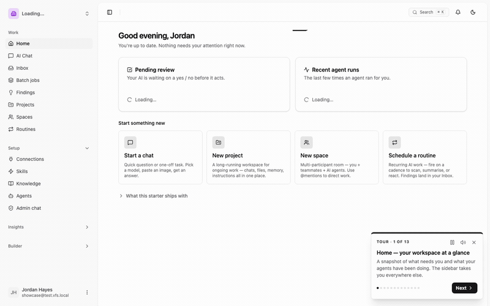](https://pub-fe51e0b1ecfb48d896a06618f6da1ed2.r2.dev/full-tour.mp4)

Every module, with real seeded data — no mockups:

| | |
|---|---|
| 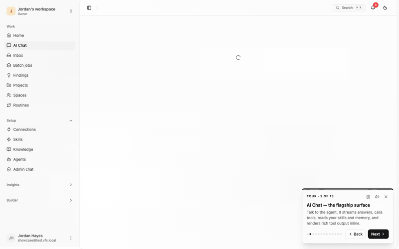 | 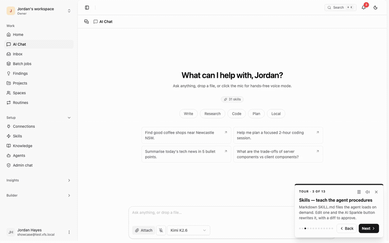 |
| **AI Chat** — streaming answers, tool calls, skills + memory, rich inline output. | **Skills** — markdown procedures the agent loads on demand; AI-Sparkle rewrites with a diff to approve. |
| 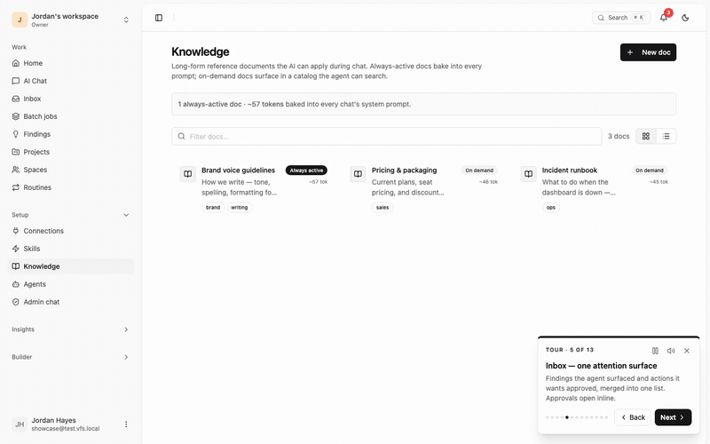 | 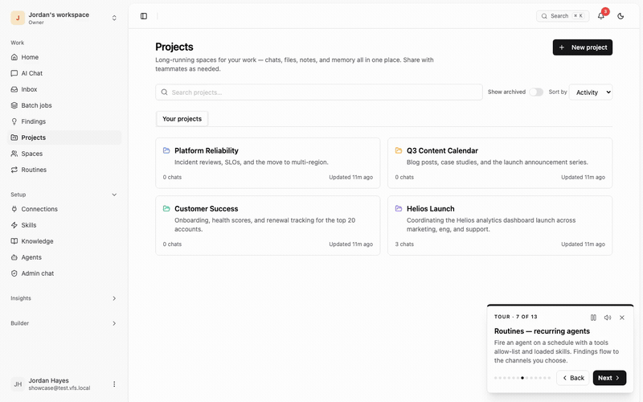 |
| **Inbox** — findings + approvals in one attention surface; approvals open inline. | **Routines** — recurring agents on a schedule; findings flow to the channels you pick. |
| 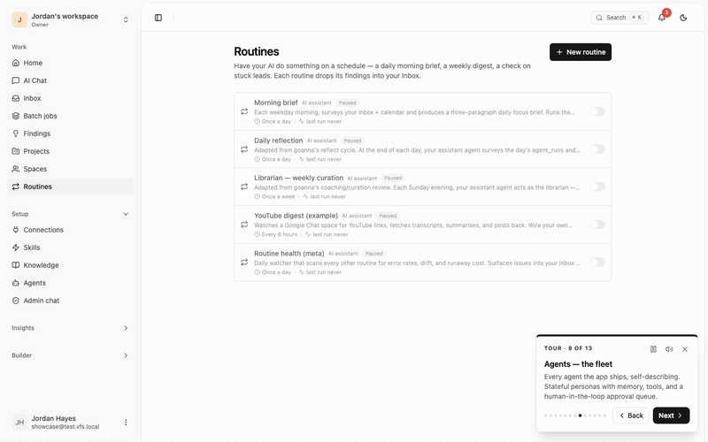 | 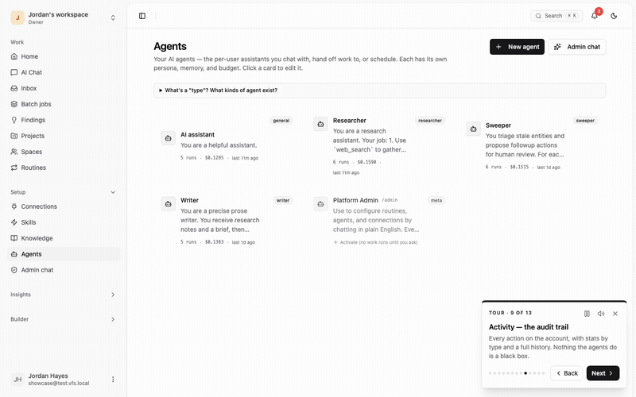 |
| **Agents** — self-describing stateful agents with memory, tools, and an approval queue. | **Activity** — the audit trail; every action with stats by type. |

More GIFs, the 13 per-module shorts, clean stills, a **9:16 vertical cut** (for Shorts/Reels), and the asset manifest live in [`assets/`](./assets/) — the videos are hosted on R2 (`manifest.json` has the URLs). Regenerate the whole set after any change: `seed-showcase.mjs` → `record-tour.mjs` → `slice-modules.mjs` → `make-gifs.mjs` → `shoot-stills.mjs` (stale demos are a choice).

### Spaces — multi-user, multi-agent rooms


The full @-mention flow: open the create modal, pick the Marketing pod template, drop into the live three-pane room with @assistant / @research / @writer as members, type `@`, the autocomplete pops, message ships with a mention pill, the agent replies in a thread, and hovering reveals the action bar. Every interaction is real — no mockups.

### Headline screenshot

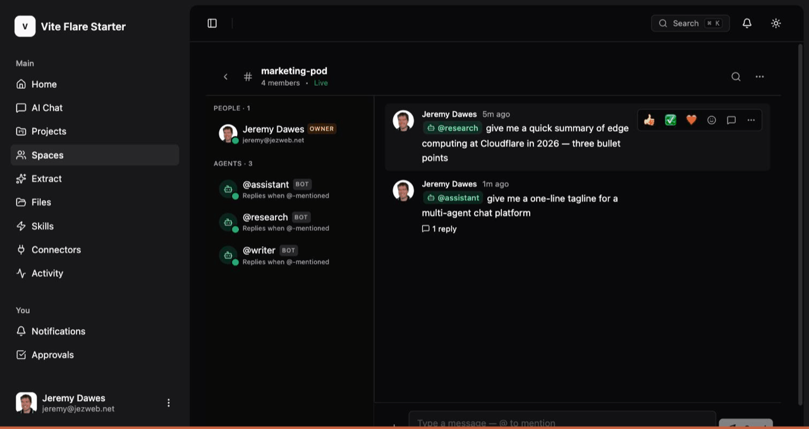

### Dashboard tour

| | |
|---|---|
| 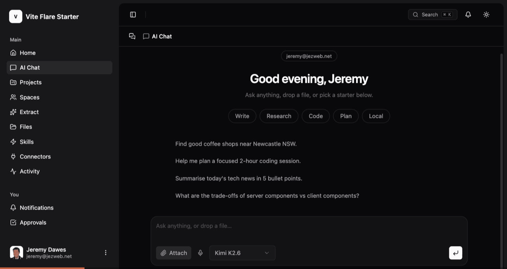 | **AI Chat** — `"Good evening, Jeremy"` greeting, 5 preset chips (Write / Research / Code / Plan / Local), starter suggestions, 16-model picker (Kimi K2.6 default), Attach + voice + drag-drop. |
| 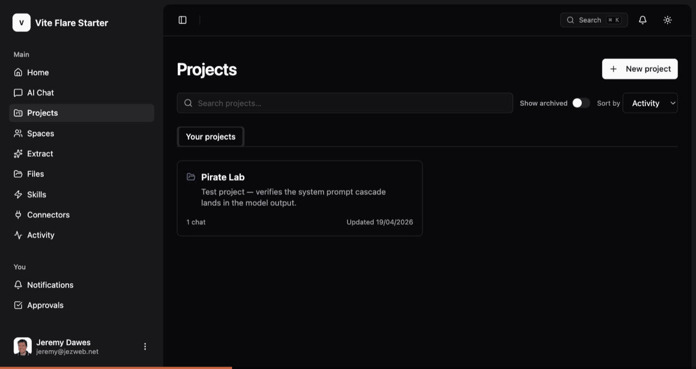 | **Projects** — long-lived workspaces grouping conversations + files + memory + instructions. Search, archive toggle, sort by activity, multi-user share. |
| 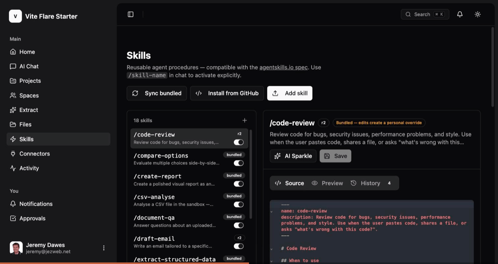 | **Skills** — 14 bundled Claude Agent Skills + Sync bundled / Install from GitHub / Add skill. AI Sparkle rewrite + History (4 versions). Source / Preview / History tabs. |
| 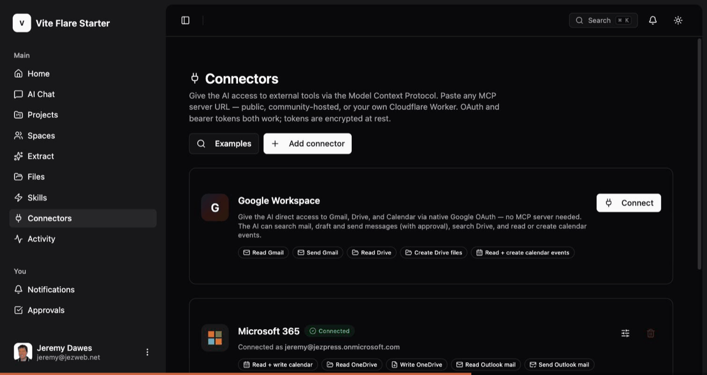 | **MCP Connectors** — Google Workspace + Microsoft 365 connect (OAuth + bearer both), per-tool always/ask/never, AES-GCM tokens at rest. |
| 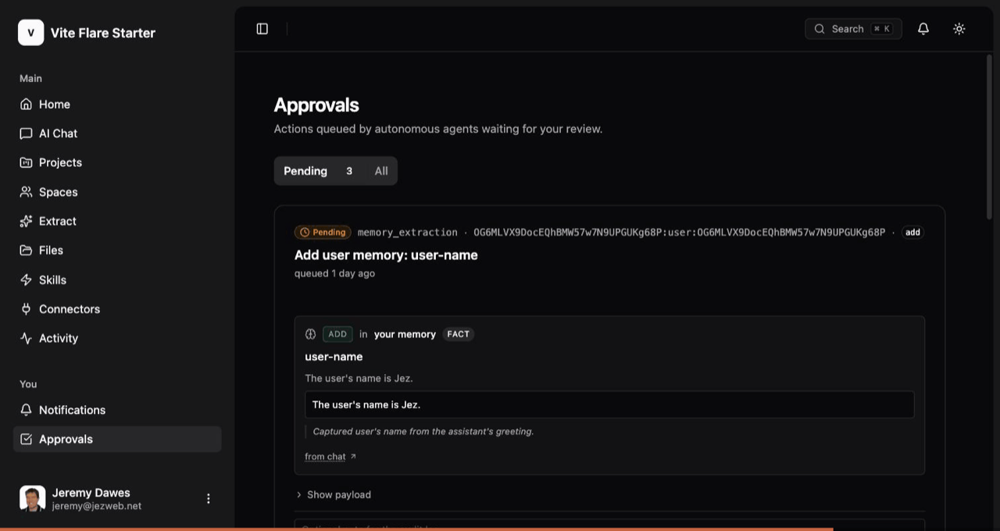 | **Approvals queue** — human-in-the-loop for autonomous agents. 3 pending memory updates with full payload preview, "from chat" deep-link to the source conversation. |
| 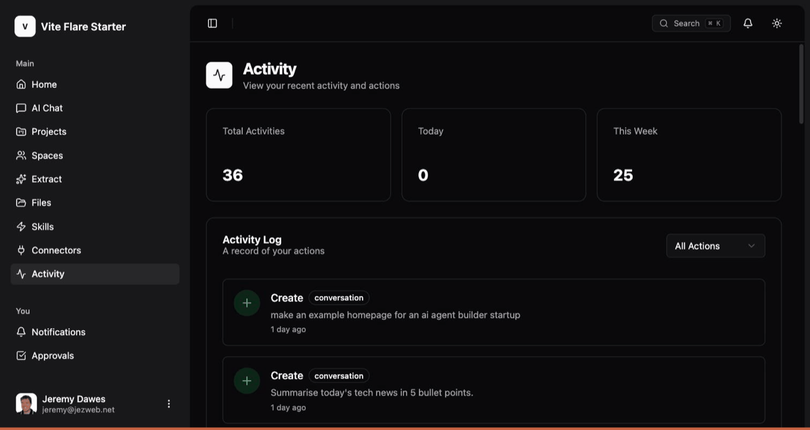 | **Activity log** — 36 total / 0 today / 25 this week stats, filtered audit trail with entity links and pagination. |

### Spaces flow — frame by frame

| | |
|---|---|
| 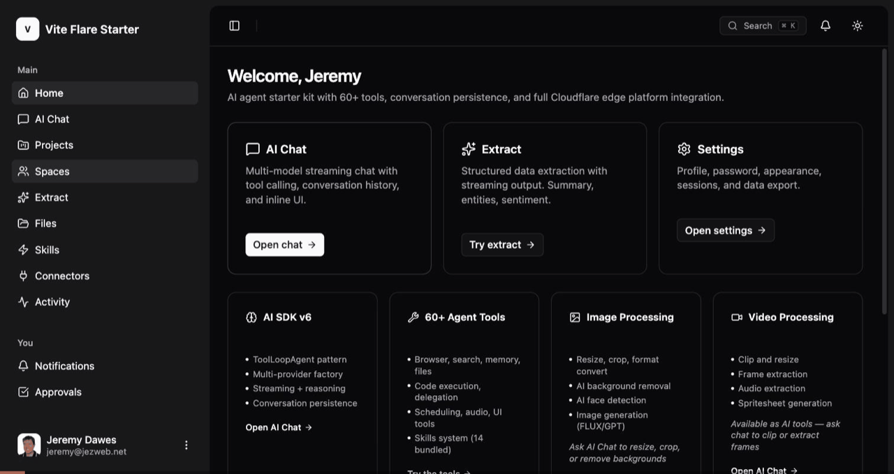 | **Empty state** — clear "Spaces are multiplayer rooms" copy + CTA. |
| 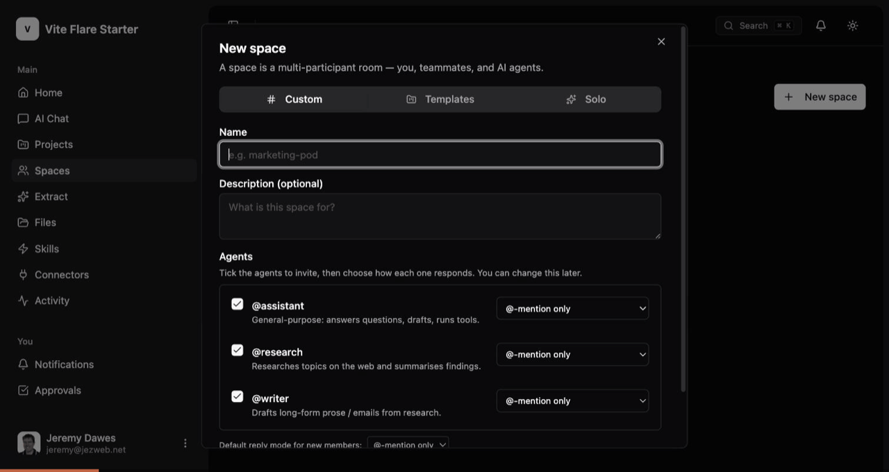 | **Create — Custom tab** — name + description + agent checkboxes + per-agent reply mode dropdown + default reply mode picker. |
| 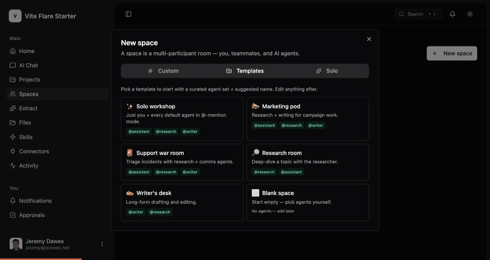 | **Create — Templates tab** — 6 starter packs (Solo workshop, Marketing pod, Support war room, Research room, Writer's desk, Blank). |
| 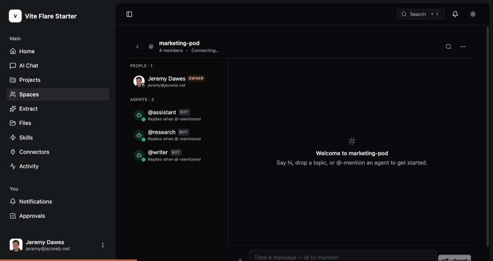 | **Detail empty** — three-pane layout (members rail · timeline · thread when open). Live presence indicator shows green when WS connected. |
| 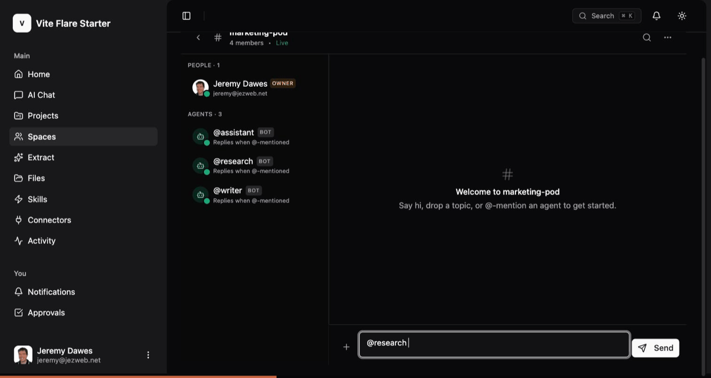 | **@-autocomplete** — People + Agents sections, keyboard navigation (↑/↓/Enter/Escape), inserts a real pill chip not text. |

### Other GIFs

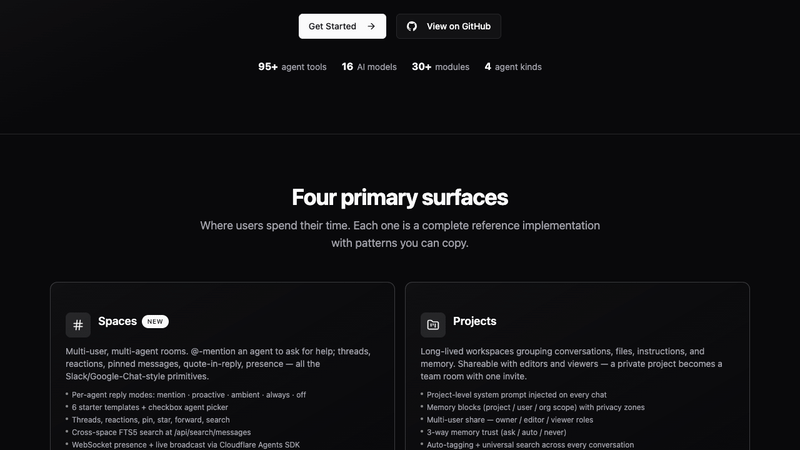

Scroll-through of the public landing page (this README's source of truth).

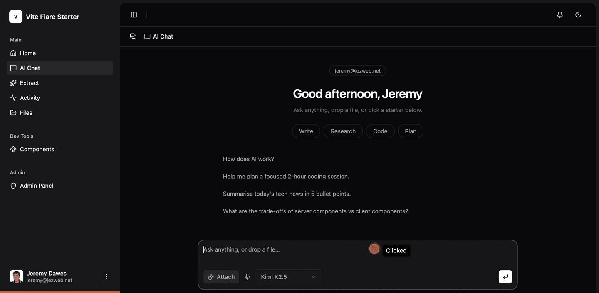

The classic `ToolLoopAgent` pattern — one prompt, two tool calls, streamed response with reasoning, token + latency footer.

---

## Headline feature: Spaces

Multi-user, multi-agent rooms — the pattern big-LLM products haven't shipped yet. @-mention an agent and they answer; threads, reactions, pinned messages, presence, the works. Built on Cloudflare Agents SDK + Durable Objects with D1 as canonical storage.

```
┌─────────────┬──────────────────────────────┬──────────────┐
│ Members     │  # marketing-pod             │ Thread       │
│ 🟢 Sarah    │  Sarah: hey @research, can   │ "@research…" │
│ 🟢 Tom      │    you grab the latest…      │ ──────────   │
│ ── Agents ──│  🤖 research: Here are the   │ Reply 1      │
│ 🤖 research │    top 3 sources I found…    │ Reply 2      │
│ 🤖 writer   │    └ 5 replies →             │ ─ Unread ─   │
│             │  Tom: 👍 ✅                  │ Reply 3      │
└─────────────┴──────────────────────────────┴──────────────┘
```

Per-agent reply modes (`mention` / `proactive` / `ambient` / `always` / `off`), 6 starter templates, threads, reactions (👍 ✅ ❤️ + emoji-mart picker), pin to space, personal star, quote-in-reply, forward to any space, cross-space FTS5 search, MCP attachments, slash sub-commands, per-thread mute, mobile drawer, history toggle. All shipped.

→ See [`docs/AGENTS.md`](./docs/AGENTS.md) and `.jez/artifacts/spaces-unified-plan-2026-04-27.md` for the architecture.

---

## Tour

| | |
|---|---|
| 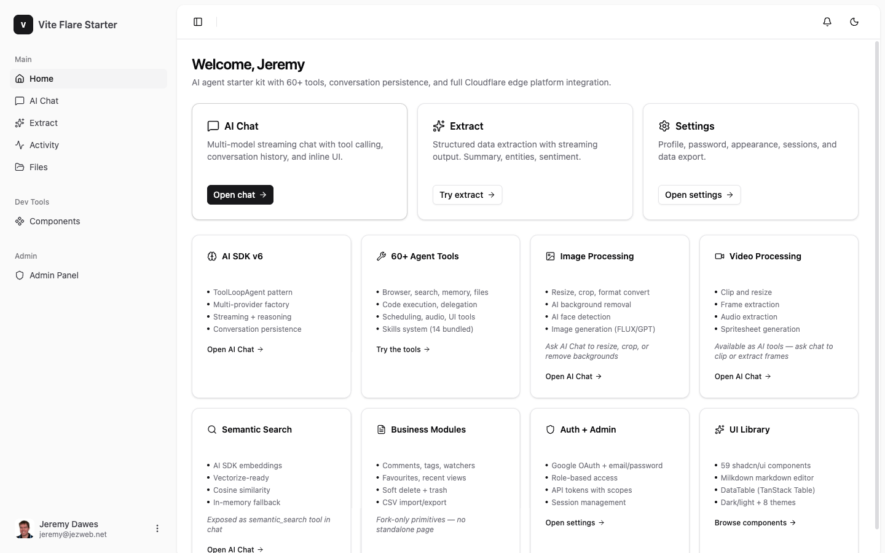 | **Dashboard shell** — config-driven sidebar with role + feature-flag gating. Edit `nav.ts`, not layouts. |
| 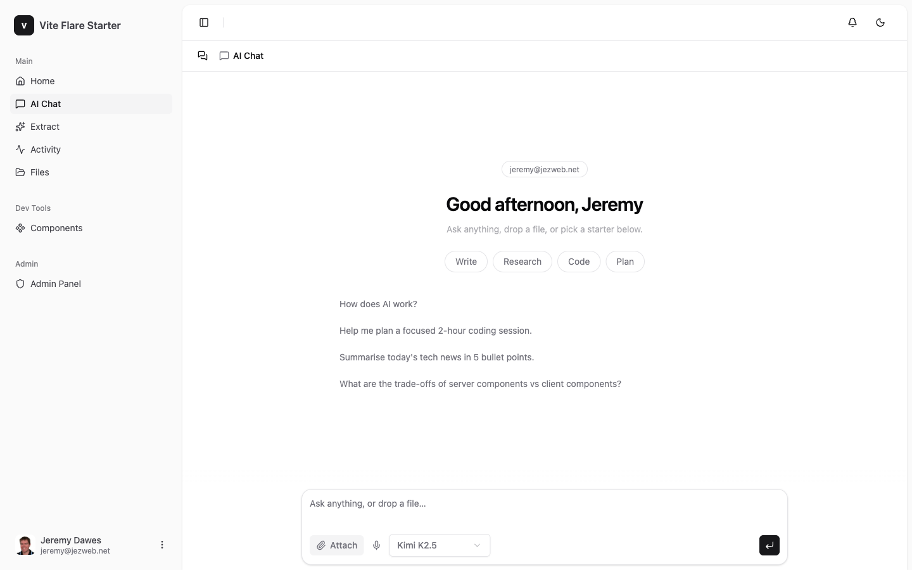 | **AI Chat** — greeting by time of day, preset prompts, persisted conversations. 16 models across 8 providers. |
| 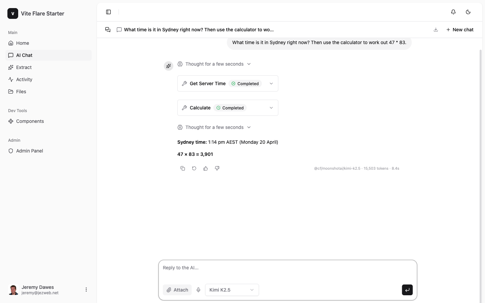 | **Agent loop in one turn** — tool chips, reasoning, streamed answer. Every call logs tokens and duration. |
| `/dashboard/spaces` | **Spaces (NEW)** — multi-user multi-agent rooms with @-mentions, threads, reactions, pin/star/quote/forward, cross-space search, proactive/ambient modes, slash sub-commands, MCP attachments. |
| `/dashboard/projects` | **Projects** — long-lived workspaces grouping conversations, files, instructions, memory. Multi-user share with editor/viewer roles (Phase 5). |
| 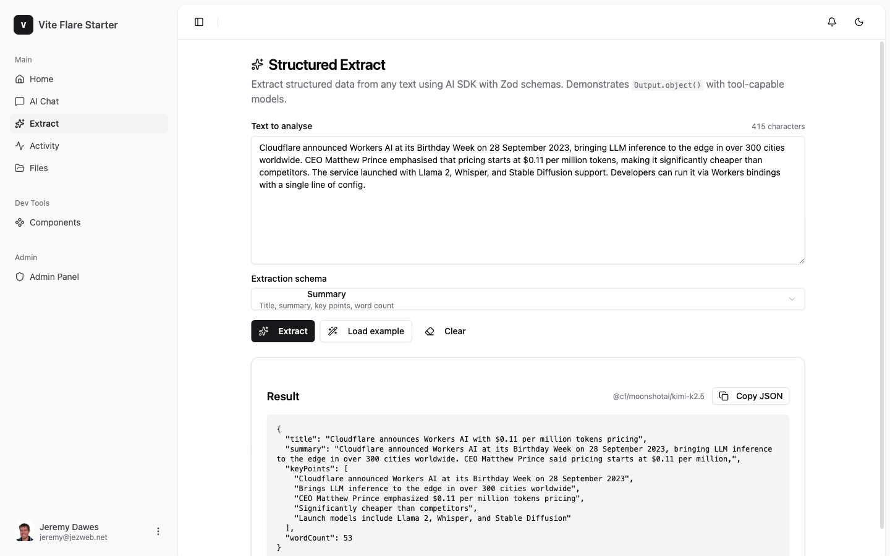 | **Structured output** — upload a document, get JSON matching a Zod schema. Uses `env.AI.toMarkdown()` for PDFs. |
| 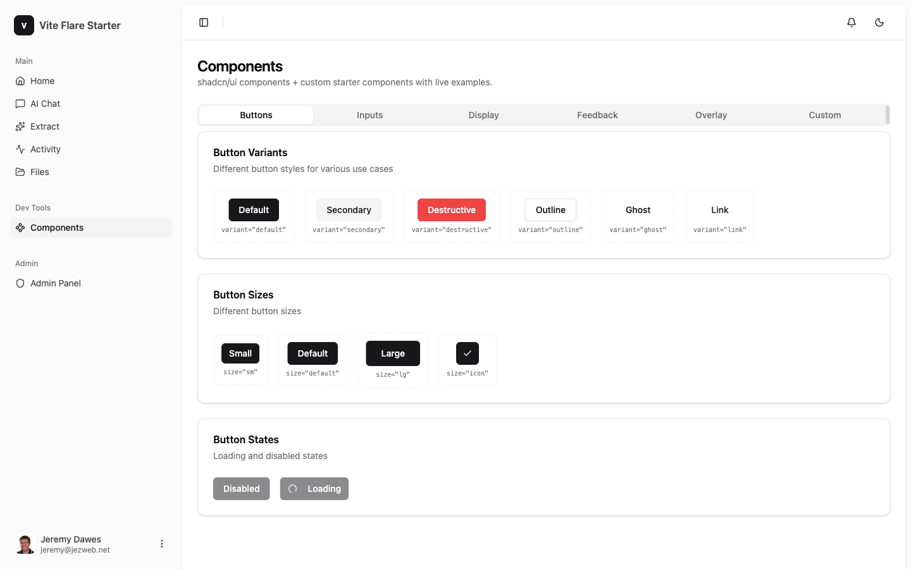 | **Components showcase** — a living pattern library of the UI primitives used throughout the app. |
| 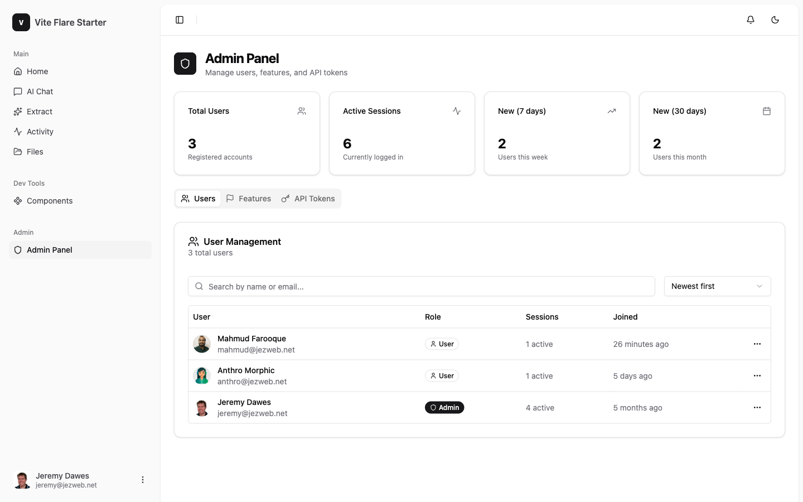 | **Admin panel** — user + role management, stats, auto-promotion via `ADMIN_EMAILS`. |
| 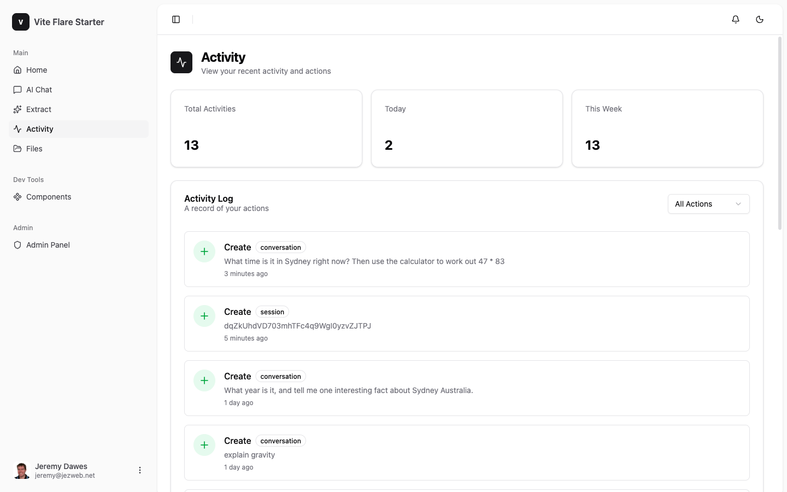 | **Activity log** — audit trail with pagination, filters, and entity history. |
| 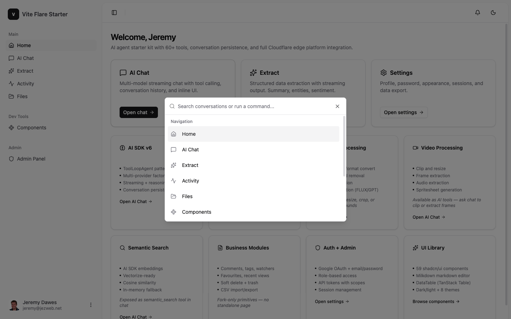 | **Cmd+K palette** — global search + navigation. Reads straight from the nav config. |

---

## What it gives you

**Multi-user multi-agent rooms (Spaces)**

- @-mention dispatch — agent members reply when called by name; per-agent reply modes (mention / proactive / ambient / always / off)
- Proactive + ambient classifier path — Workers AI Gemma 4 26B decides "should @<name> jump in or react?" with 2-call cap per top-level message
- Threads with auto-thread for long agent replies (>800 chars), per-thread bell mute via `thread_subscriptions`
- Reactions: 👍 ✅ ❤️ quick-bar + lazy-loaded emoji-mart full picker; bots react with the same icons humans do
- Pin to space (admin/owner — pinned shelf in the header), personal star, quote-in-reply with chip preview, forward message to any space you're in
- 6 starter templates (Solo workshop, Marketing pod, Support war room, Research room, Writer's desk, Blank) + per-agent checkbox + reply-mode picker
- Cross-space FTS5 search (`/api/search/messages?q=`) + in-space FTS5 (LIKE-scan fallback)
- WebSocket presence + live broadcast via Cloudflare Agents SDK; D1 is canonical storage, DO is just for live fan-out
- "+ menu" attachments — Attach file, Reference project, Reference MCP resource (server-side `resources/list` JSON-RPC)
- Slash sub-commands — `@research /summarise <url>` lifts the slash command into structured agent guidance
- Block member, history toggle (24h auto-delete sweep), card-format bot messages for daily digests
- Multi-user Projects (Phase 5) — `project_members` table, owner/editor/viewer, share dialog with invite

**AI agent layer**

- `ToolLoopAgent` pattern (AI SDK v6) with `createAgentUIStreamResponse`
- 95+ agent tools across 20 modules — Gmail, Calendar, Docs, Sheets, Drive, Tasks, browser automation, web search, places, code execution, files, memory, UI widgets, audio, todo, delegation
- Unified `ToolDefinition<I, O>` contract — every tool has a strict Zod output schema + optional typed client renderer, enforced end-to-end
- Skills system (Claude Agent Skills compatible) — bundled, R2, or GitHub sources
- Conversation persistence via `ChatStorage` interface (D1 today, DO-ready)
- Subagent delegation with role-based tool assignment
- Human-in-the-loop via `needsApproval` on destructive tools, with `sendAutomaticallyWhen` auto-resubmit so the Approve button just works
- Privileged-tool gating — destructive tools (`gmail_send`, `calendar_delete_event`, `sheets_write_range`, etc.) stay hidden from the model unless user intent matches a keyword unlock
- Per-tool telemetry in `ai_tool_calls` D1 table + admin "Tool errors" tab for 24h observability
- Natural-language query translation — pass `naturalQuery: "emails from nick last week"` instead of constructing Gmail operator syntax; server translates via Nemotron 3
- Sources footer under assistant messages — claude.ai-style citation strip aggregated from tool outputs (web_search, gmail, drive, places) + native `source-url` / `source-document` SDK parts
- 16 models across 8 providers (Workers AI free tier + OpenRouter unlocks the rest)
- MCP integration (tools, resources, prompts, elicitation) + MCP-UI rendering

**Application framework**

- Auth — `better-auth` with Google OAuth (email/password optional), deep-link preserved through sign-in via `?next=`
- Admin — role-based access (user/manager/admin), auto-promotion via `ADMIN_EMAILS`, Tool Errors tab for 24h tool-call failure observability
- MCP Connectors — per-user OAuth to external MCP servers, PKCE + DCR flow, tokens AES-GCM encrypted at rest, per-tool always/ask/never policies
- Google Workspace — per-user OAuth with automatic token refresh, granular scope tracking, 26 tools across 6 Google services
- Config-driven sidebar — add nav items in `nav.ts`, feature-flag modules in `features.ts`
- UI — Tailwind v4 + shadcn/ui (~80 primitives), 8+ themes, dark/light/system
- Layout primitives — three list-page shapes (queue / cards / table) with copy-paste scaffolds in `_template/`, themed `Chart` wrapper for trends. Picker rule in CLAUDE.md.
- Command palette — Cmd+K, keyboard shortcuts
- Files — R2 upload/download with D1 metadata
- Activity — audit log with pagination and entity history
- Notifications — in-app, unread counts, URL-persisted filter
- API tokens — SHA-256 hashed, scope-based
- Feature flags — DB-backed with admin API

---

## Tech stack

| Layer | Technology |
|---|---|
| Platform | Cloudflare Workers with Static Assets |
| Frontend | React 19 + Vite 7 |
| Backend | Hono 4.12 |
| Database | D1 (SQLite) + Drizzle ORM 0.45 |
| Auth | better-auth 1.6 |
| AI | AI SDK v6 + workers-ai-provider + OpenRouter |
| UI | Tailwind v4 + shadcn/ui |
| Data | TanStack Query 5 + `apiClient` |
| Forms | React Hook Form + Zod |
| Testing | Vitest 4 + `@cloudflare/vitest-pool-workers` |

---

## Quick start

```bash
git clone https://github.com/jezweb/vite-flare-starter.git my-app
cd my-app
pnpm install

pnpm cf:login
npx wrangler d1 create my-app-db       # copy database_id into wrangler.jsonc
npx wrangler r2 bucket create my-app-avatars
npx wrangler r2 bucket create my-app-files

cp .dev.vars.example .dev.vars         # fill in BETTER_AUTH_SECRET, Google OAuth creds
pnpm db:migrate:local
pnpm dev
```

Open [http://localhost:5173](http://localhost:5173) and sign in.

**Going to production?** See [GOING-LIVE.md](GOING-LIVE.md): creating the remote D1 + R2, running migrations, setting secrets, the better-auth / Google-OAuth URL gotcha that wastes an afternoon, deploy, and your own domain.

---

## Agent toolkit

Tools live in `src/server/modules/chat/tools/` and are auto-included based on available bindings.

| Module | Tools | Requires |
|---|---|---|
| core | `get_server_time`, `get_model_info`, `calculate` | Always |
| memory | `remember`, `recall`, `search_memory`, `forget` | Always |
| ui | 13 inline UI components (choices, alerts, tables, timelines, progress, comparison, confirm, metrics, contact, collect, ask, show_map, image) | Always |
| skills | `load_skill` | Always |
| todo | `todo_add`, `todo_update`, `todo_list`, `todo_clear` | Always |
| delegate | `delegate` (role-based subagent spawn) | Always |
| audio | `transcribe_audio`, `speak_text` | Always (AI binding) |
| documents | `convert_document`, `read_pdf` | Always (AI binding) |
| code | `run_python`, `run_shell`, `run_js` | `SANDBOX` DO binding |
| browser | `browser_markdown`, `browser_extract`, `browser_screenshot`, `browser_links`, `browser_content` | CF API token |
| search | `web_search` | One of Serper / Brave / Tavily / Exa key |
| places | `places_search`, `places_details` | `GOOGLE_PLACES_API_KEY` |
| files | `fs_list`, `fs_read`, `fs_write`, `fs_delete` | `FILES` R2 bucket |
| **Google Workspace** — Gmail | `gmail_search`, `gmail_get_message`, `gmail_list_labels`, `gmail_draft`, `gmail_reply`, `gmail_send` | Per-user OAuth |
| **Google Workspace** — Drive | `drive_search`, `drive_get_file`, `drive_create_folder` | Per-user OAuth |
| **Google Workspace** — Calendar | `calendar_upcoming`, `calendar_list_events`, `calendar_get_event`, `calendar_find_free_slot`, `calendar_create`, `calendar_update_event`, `calendar_delete_event` | Per-user OAuth |
| **Google Workspace** — Docs | `docs_search`, `docs_get`, `docs_create`, `docs_append` | Per-user OAuth |
| **Google Workspace** — Sheets | `sheets_list_tabs`, `sheets_read_range`, `sheets_append_row`, `sheets_write_range` | Per-user OAuth |
| **Google Workspace** — Tasks | `tasks_list`, `tasks_create` | Per-user OAuth |

Each tool is a `ToolDefinition<Input, Output>` export in its domain file. Strict Zod schemas on both sides are type-inferred through to the renderer, so a server change flows to the client without either side silently drifting. `collectAvailableTools(allDefinitions, ctx)` filters at request time — a tool's `isAvailable(ctx)` predicate decides whether the binding / API key / OAuth scope is present. No accidental shipping of a tool for a service that isn't configured.

Adding a tool: add a file in `tools/`, export a `ToolDefinition`, register in `tools/index.ts`. That's it — telemetry, approval flow, active-tools gating, and the SDK-compatible `tool()` wrapper all come for free.

---

## Skills

Claude Agent Skills compatible — same SKILL.md format as Claude Code, Cursor, Hermes, OpenClaw, Aider.

```
skills/
  web-research/SKILL.md
  draft-email/SKILL.md
  code-review/SKILL.md
  extract-structured-data/SKILL.md
  ...12 total
```

Progressive disclosure: only names + descriptions are in the system prompt. The full body loads on demand via `load_skill`. Register more skills from GitHub URLs or R2 uploads at runtime.

---

## Multi-provider AI

One `resolveModel()` call picks the right provider from the model string.

```typescript
resolveModel(env, '@cf/moonshotai/kimi-k2.5')        // Workers AI — free
resolveModel(env, 'claude-sonnet-4-6')                // Anthropic
resolveModel(env, 'gpt-5.4-mini')                     // OpenAI
resolveModel(env, 'gemini-3.1-pro')                   // Google
resolveModel(env, 'openrouter/deepseek/deepseek-v3.2') // OpenRouter
```

Model catalogue is a bundled snapshot from [models.flared.au](https://models.flared.au). Refresh with `pnpm models:refresh`.

---

## Deployment

```bash
printf "secret" | npx wrangler secret put BETTER_AUTH_SECRET
printf "https://your-app.workers.dev" | npx wrangler secret put BETTER_AUTH_URL
printf "http://localhost:5173,https://your-app.workers.dev" | npx wrangler secret put TRUSTED_ORIGINS

pnpm db:migrate:remote
npx wrangler deploy
```

Always use `printf` not `echo` — `echo` appends a newline that breaks HMAC signatures.

---

## Commands

| Command | Does |
|---|---|
| `pnpm dev` | Local dev server |
| `pnpm build` | Production build |
| `npx wrangler deploy` | Deploy to Cloudflare |
| `pnpm db:generate:named "x"` | Create a new Drizzle migration |
| `pnpm db:migrate:local` | Apply migrations to local D1 |
| `pnpm db:migrate:remote` | Apply migrations to production D1 |
| `pnpm models:refresh` | Refresh the bundled AI model catalogue |
| `pnpm test` | Run tests |
| `pnpm type-check` | Strict TypeScript check |

### Two gotchas when extending the build

These trip every fork that ships an embeddable widget or secondary bundle:

**1. Build order matters when writing into `public/`**. `vite build` copies `public/` into `dist/client/` early in its pipeline. Any secondary build that writes into `public/` must run **before** the main build, otherwise the stale copy gets shipped:

```jsonc
// ❌ Wrong — widget bundle lands in public/ after vite already copied
"build:all": "pnpm build && pnpm build:widget"

// ✅ Right — widget bundle gets picked up
"build:all": "pnpm build:widget && pnpm build"
```

Or output the secondary bundle directly into `dist/client/` and skip `public/`.

**2. Cloudflare Workers Static Assets cache by path, not query string**. Bumping `?v=1.2.3` does NOT invalidate the edge cache for `widget.js`. The only ways: ship new bytes (etag changes automatically) or purge by URL via the CF API. Plan your asset cache-busting around content hashes, not query params.

---

## Philosophy

This is a **pattern library**, not a demo.

Every module teaches one technique for this stack — ToolLoopAgent, D1-first storage, R2 uploads, feature flags, audit logging, OAuth on Workers, MCP integration. When you build a new feature in a fork, read the closest existing module first.

Don't delete modules you don't need. Disable them via `src/shared/config/features.ts` — the code stays as a reference. Future-you, or the next AI agent working in the fork, will thank you.

---

## Documentation

- **[CLAUDE.md](./CLAUDE.md)** — Developer context: architecture, patterns, how to build features
- **[FORKING.md](./FORKING.md)** — Step-by-step guide for starting a new product from this base
- **[CONTRIBUTING.md](./CONTRIBUTING.md)** — How to file useful issues + send fixes back upstream
- **[CHANGELOG.md](./CHANGELOG.md)** — Release notes and what changed when

---

## Contributing back

Forks of the starter often spot bugs and rough edges the maintainer
missed. PRs back are welcome — see
[CONTRIBUTING.md](./CONTRIBUTING.md) for what makes a useful issue
(diagnosis + repro + severity) and the kinds of upstream contributions
that fit the "pattern library" shape of the starter.

---

MIT — see [LICENSE](./LICENSE).
